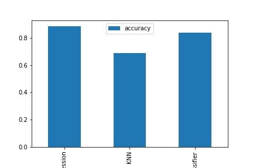
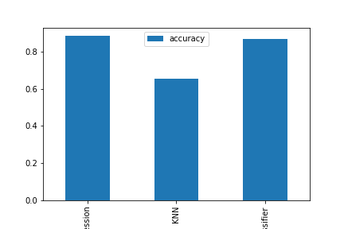

# Heart_Disease_Classification

# Predicting heart disease using Machine Learning

This notebook looks into using various Python-bases ML and data science libraries in an attempt to buuild a ML model caable of prediction whether or not someone has heart disese based on their medical attributes.

We're going to take the following approach:
1. Problem defination
2. Data
3. Modelling
4. Features
5. Modelling
6. Experimentation

## 1. Problem Defination

> Given a clinical parameters about the patient, can we predict whether or not they have heart disease?

## 2. Data

The original data came from the cleaveland data from the UCI Machine Learning Repository. https://archive.ics.uci.edu/ml/datasets/heart+Disease

There is also a version of it availaible on Kaggle. 
https://www.kaggle.com/ronitf/heart-disease-uci

## 3. Modelling

* Algorithms used
  * Logistic Regression
  * KNN
  * Random Forest

* Baseline Model Comparison
  * Since we are predicting for classification model default evaluation metric is accuracy for baseline model
  
  
  
  

## 4. Hyperparameter Tuning 

* Using RandomSearchCV

  

* Using GridSearchCV
  * Since our logistic regression model provides the best results scores so far, therefore tried to improve score using GridSearchCV which gave results
    as **0.8852459016393442**
  
## 5. Evaluation using different metrics

* ROC and AUC curve

  
    
